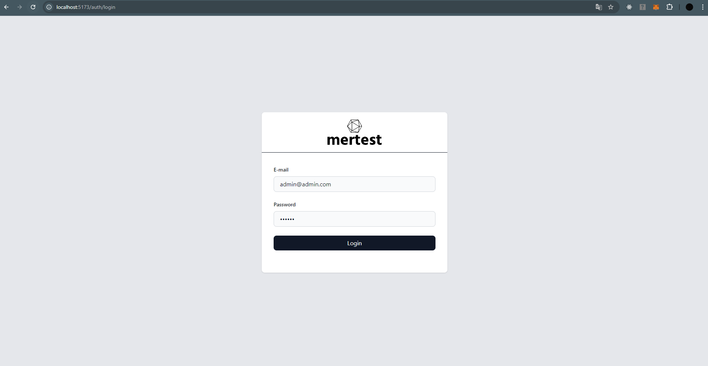
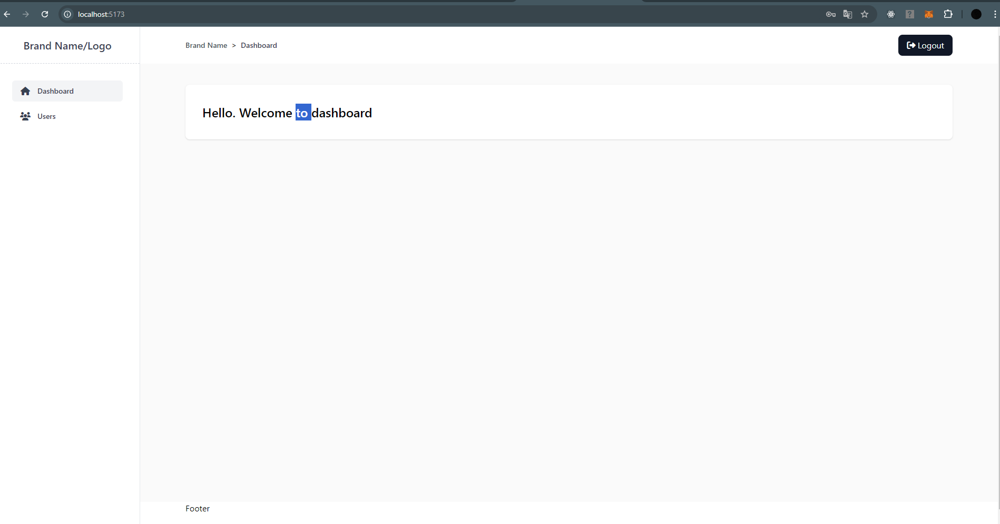
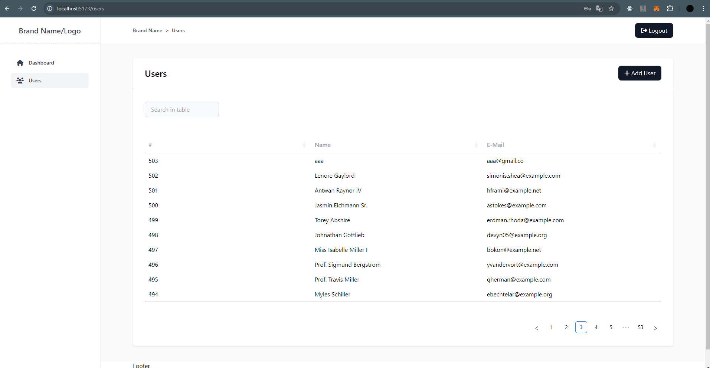
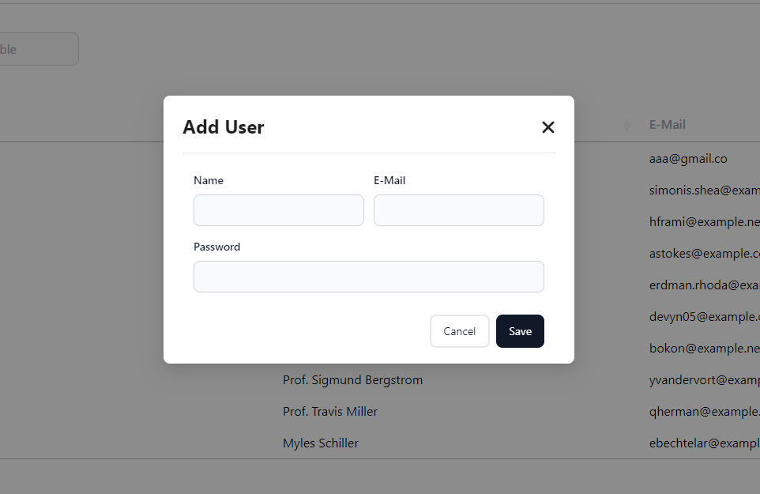

An application that handles authentication with JWT tokens and supports pagination, sorting and searching through datatables.

## Project Setup

```sh
npm install
```

### Compile and Hot-Reload for Development

```sh
npm run dev
```

### Compile and Minify for Production

```sh
npm run build
```

### Backend Project

https://github.com/MertMustehlik/laravel-authentication-datatable

## Screenshots

### Login


### Dashboard


### Users


### Create User


